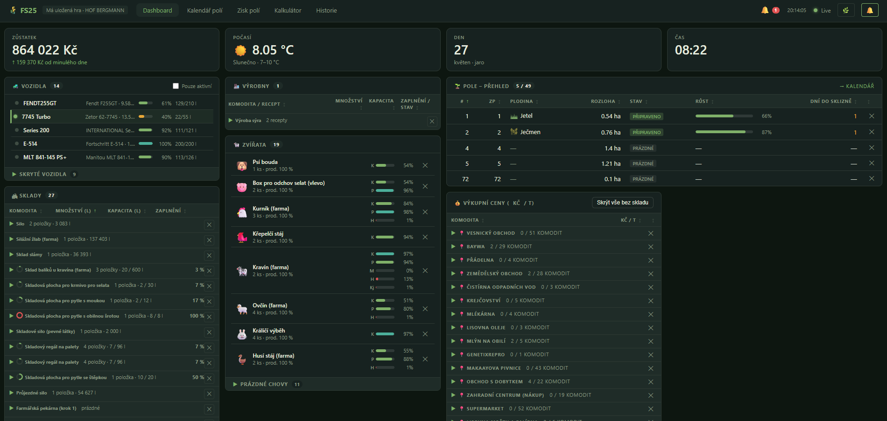
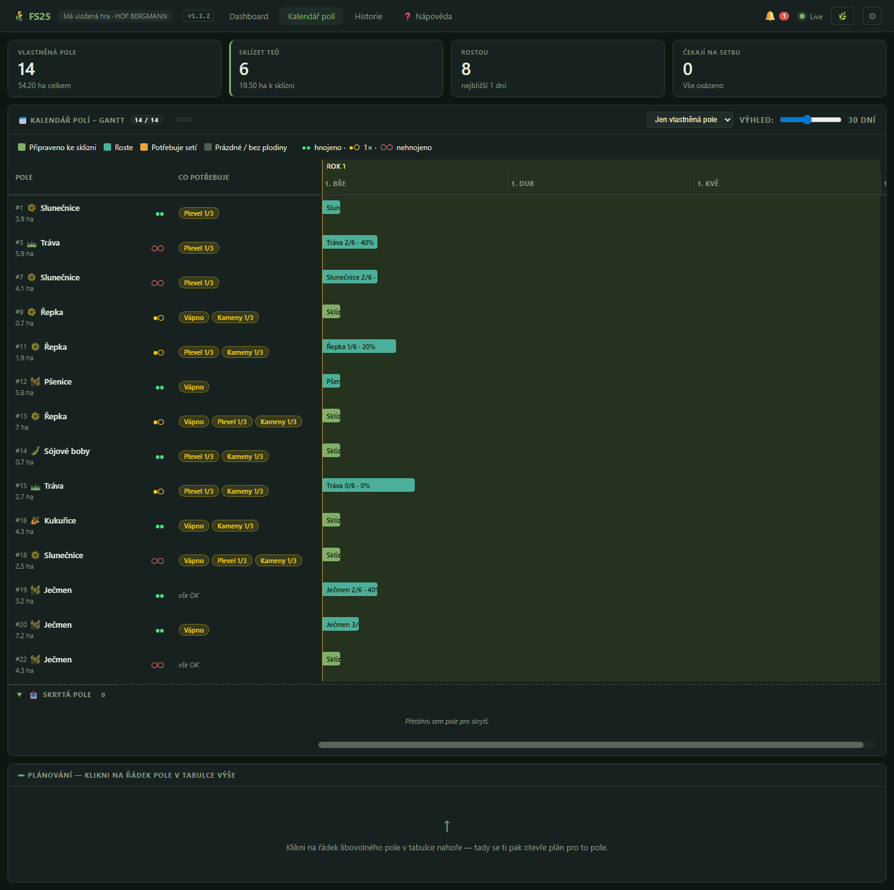
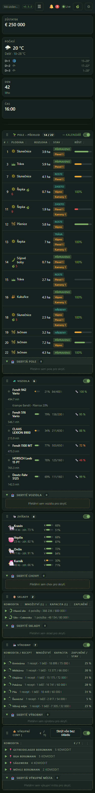
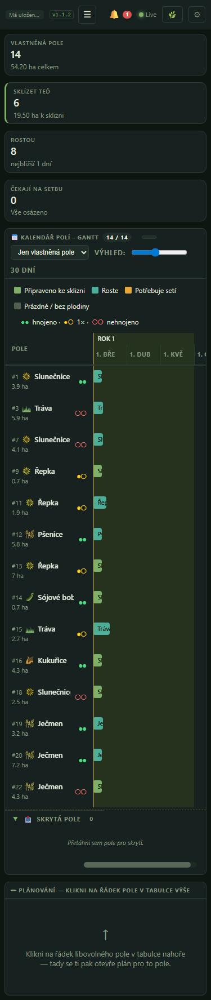

# FS25 Dashboard

**Čeština** · [English](README.en.md)

Real-time webový dashboard pro **Farming Simulator 25** — pole, vozidla, zvířata, sila, ceny a zůstatek farmy živě v prohlížeči vedle hry.

  



---

## ⚠️ Pozor — osobní hobby projekt

Tohle je můj soukromý projekt, který jsem si dělal pro sebe a ze kterého jsem se rozhodl udělat veřejnou verzi. Není to komerční ani profesionálně vyvíjený produkt.

- **Vyvíjeno proti vanilla mapám.** Funguje to dobře na základních mapách. Na community mapách (Hof Bergmann atd.) je to převážně otestované, ale chyby specifické pro konkrétní map-pack se nemusí dočkat opravy.
- **Není garantovaná zpětná kompatibilita** mezi verzemi FS25. Když přijde patch a něco se v API rozbije, oprava může chvíli trvat — nebo se nemusí stát vůbec.
- **Multiplayer**: funguje v singleplayer a u hostujícího hráče (listen server). Dedikovaný server zatím nepodporuji a v dohledné době ani nebudu.
- **Issues a PR vítané**, ale neslibuji rychlou (ani žádnou) odpověď. Pokud něco potřebuješ urgentně, **forkni si to** a uprav podle sebe — proto je to MIT licence.

Pokud ti něco nefunguje, klidně otevři issue, ale ber to s rezervou. Pokud chceš stabilní produkt, tohle není ono.

---

## Co to ukazuje

- 🚜 **Vozidla** — palivo / AdBlue %, motohodiny, **kondice (🔧 %) a aktuální rychlost**, AI/Courseplay/AutoDrive úkoly. Připojené nářadí (vlečka, secí stroj…) ukazuje naplněnost hned po připojení a **blikne při změně** (zeleně přibývá / červeně ubývá). Drag & drop na skrytí.
- 🐄 **Zvířata** — krmivo / voda / sláma, sklad mléka / hnoje, produktivita. Upozornění, když něco dochází.
- 🌾 **Pole** — vlastnictví, plodina, % růstu, dny do sklizně, hnojení / vápno / orba. Stav se čte z `fields.xml` — sedí s in-game UI.
- 🏭 **Sila & výrobny** — všechny výrobny farmy (mlékárna, pekárna, pila, BGA…), co máš na skladě, jaké recepty běží, stav výstupu.
- 💰 **Výkupní ceny** — aktuální ceny za tunu, sortovatelné, filtr na to, co máš na skladě.
- 📅 **Kalendář polí** — Gantt timeline s rotací plodin per pole; každá plodina má vlastní řadu (nepřekrývají se). Naplánuje práce: orba (jen když ji hra vyžaduje), vápnění, setba, **dvě fáze hnojení**, válcování, **okno plevele**, sklizeň. Vlastní pořadí plodin v menu přes drag-and-drop. Roky se přepínají na 1. března (FS25 herní rok), pozadí střídá liché/sudé kalendářní roky pro orientaci.
- 📈 **Historie** — vývoj zůstatku a cen komodit za 7 / 30 / 90 dní + sezónní křivka cen na 12 měsíců dopředu. **Klikni na sloupec měsíce a hlídej cenu notifikací** (🔔 vyskočí, až herní kalendář dorazí do nejdražšího měsíce). Záznamy tagované savegame ID — přepnutí slotu nesmíchá data.
- 📱 **Mobilní zobrazení** — funguje na telefonu (375 px+): hamburger menu, kompaktní Gantt, single-column layout.
- 🔔 **Browser notifikace** — málo paliva, málo krmiva, pole připravené ke sklizni, dlouho prázdné pole, sezónní cenový vrchol.

Funguje s **AdditionalCurrencies** — když máš zapnutý in-game převodník měny, dashboard zrcadlí stejnou měnu a symbol.



### Na mobilu

Dashboard a kalendář na šířce telefonu (375 px) — hamburger menu, sekce pod sebou, kompaktní Gantt:

<p>
  
  
</p>

---

## Co je potřeba

- Farming Simulator 25 (jakákoli verze)
- Windows (server je Windows .exe)
- Moderní prohlížeč (Chrome / Edge / Firefox)
- ~60 MB volného místa

Node.js **není potřeba** — server je single-file binárka se zabaleným runtimem. Pokud chceš spouštět ze zdrojáku nebo si exe sestavit sám, viz *Development* níže.

---

## Instalace

### 1. In-game mod

Stáhni `FS25_Dashboard.zip` z [Releases](../../releases) a hoď ho do:

```
Documents/My Games/FarmingSimulator2025/mods/
```

V FS25 mod menu zapni při načítání save.

### 2. Server

Stáhni `FS25_Dashboard_Server.zip` z [Releases](../../releases) a rozbal kamkoli.

Dvojklik na `FS25_Dashboard_Server.exe`. Otevře se konzolové okno s logem. Pak v prohlížeči:

```
http://localhost:3000
```

Konzoli nech otevřenou, dokud hraješ. Server čte `Documents/My Games/FarmingSimulator2025/dashboard_data.json` (mod ho přepisuje každé 2 s) a pushuje změny do prohlížeče přes WebSocket.

Zastavení serveru: zavři okno konzole (nebo Ctrl+C).

---

## Jak to funguje

```
FS25 hra (Lua mod)
    │
    │ zapisuje dashboard_data.json každé 2 s při změně stavu
    ▼
Node.js Server  (Express + WebSocket + chokidar file watcher)
    │
    │ obohacuje payload o XML metadata ze save folderu
    │ (fields.xml, farms.xml, farmland.xml) — XML je zdroj
    │ pravdy pro persistentní stav polí
    │
    │ appendoduje denní snapshoty do data/*.jsonl (balance,
    │ ceny, field eventy) pro stránky historie + zisk
    │
    ▼
Prohlížeč
    └─ dostává živé updaty přes WebSocket (žádný reload)
    └─ REST endpointy pro historická data
```

Mod nemá žádné externí závislosti, zapisuje plain JSON. Server je vanilla JS (bez bundleru, bez frameworku) — snadno se forkne a upraví.

---

## FAQ

**Otázka: Server nenašel data z hry / chci změnit složku nebo port.**
Nemusíš editovat žádné soubory. Když server při spuštění nenajde data z FS25,
v prohlížeči se sám objeví **uvítací průvodce** — detekuje standardní složku, dá
ti ji ověřit (✓ log.txt, savegamy) a uloží nastavení za tebe. Kdykoliv později
ho otevřeš přes **⚙ Nastavení → 📁 Připojení** (změna cesty/portu vyžaduje restart serveru).

Pokročilá / ruční alternativa: zkopíruj `config.example.json` na `config.local.json`
(vedle .exe) a uprav. Nebo nastav env proměnné:

```powershell
$env:DASHBOARD_PORT="4000"
$env:FS25_DOCS_DIR="D:\Games\FS25-Docs"   # když máš Documents přesměrované
.\FS25_Dashboard_Server.exe
```

Dostupné klíče (env / json):
- `DASHBOARD_PORT` / `port` — default `3000`
- `DASHBOARD_HOST` / `host` — default `0.0.0.0` (všechna rozhraní)
- `DASHBOARD_OPEN_BROWSER` / `openBrowser` — po startu otevřít dashboard v prohlížeči (default `true`; vypneš v Nastavení → Připojení)
- `FS25_DOCS_DIR` / `fs25DocsDir` — root `My Games\FarmingSimulator2025`
- `DASHBOARD_DATA_FILE` / `dataFile` — full path k `dashboard_data.json`
- `FS25_LOG_FILE` / `logFile` — full path k FS25 `log.txt`
- `DASHBOARD_DATA_DIR` / `dataDir` — kam ukládat historii JSONL

**Otázka: Funguje to v multiplayeru?**
Singleplayer a hosting (listen server): ano. Klient na dedikovaném serveru: zatím ne — mod čte stav hry z host-side `g_currentMission`.

**Otázka: Kde je save folder?**
`Documents/My Games/FarmingSimulator2025/savegame<N>/`. Server auto-detekuje nejnovější save.

**Otázka: Můžu si dashboard otevřít na jiném PC / mobilu?**
Ano — najdi IP svého PC (např. `192.168.1.20`) a na druhém zařízení otevři `http://192.168.1.20:3000`. Musí být na stejné síti.

**Otázka: Funguje to s jinými mody (Seasons Geo, Courseplay, ...)?**
Většina věcí jo. Mapy, které mění chování polí / farmlandu, můžou vykazovat nesrovnalosti. Otevři issue, ale ber prosím v úvahu disclaimer výše.

**Otázka: Zpomalí mi to hru?**
Mod zapisuje JSON jednou za 2 s, jen když se něco změnilo. Zanedbatelné CPU. Dashboard běží mimo proces hry.

---

## Vlastní notifikace

Klikni na 🔔 v horní liště. Můžeš nastavit prahy pro málo paliva, málo krmiva, prázdná pole a cooldown mezi opakovanými upozorněními. Stav se ukládá do `localStorage`.

---

## Development

Klon repa, pak:

```bash
cd Server
npm install
npm run mock    # generuje fake dashboard_data.json — UI dev bez FS25
npm start       # v druhém terminálu, servíruje dashboard
```

Sestavení Windows .exe lokálně:

```bash
cd Server
npm install
npm run build   # produkuje dist/FS25_Dashboard_Server.exe (~50 MB)
```

Mod je v `FS25/`. Spusť `deploy.bat` — postaví ZIP a zkopíruje do FS25 mods folderu.

---

## Přispívání

Issues a PR vítané (viz disclaimer výše). U bug reportu prosím:
- Verzi FS25
- Ostatní aktivní mody
- Kus `dashboard_data.json` ukazující problém
- Browser konzole errory, pokud je problém vizuální

---

## Licence

MIT — viz [LICENSE](LICENSE).
